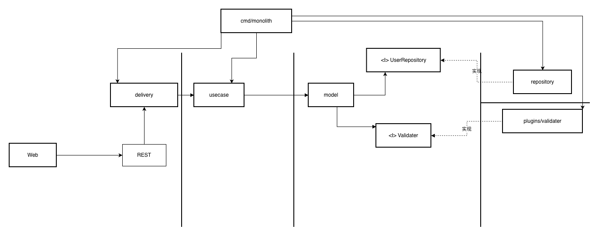

# Scalable E-Commerce

A scalable e-commerce backend built with Go.

WIP

This project is based on the [roadmap.sh Scalable E-Commerce Platform](https://roadmap.sh/projects/scalable-ecommerce-platform) project.

## Run

### Monolith
```bash
go build -o bin/monolith ./cmd/monolith
./bin/monolith
```

## Architecture（WIP）

### User Component


